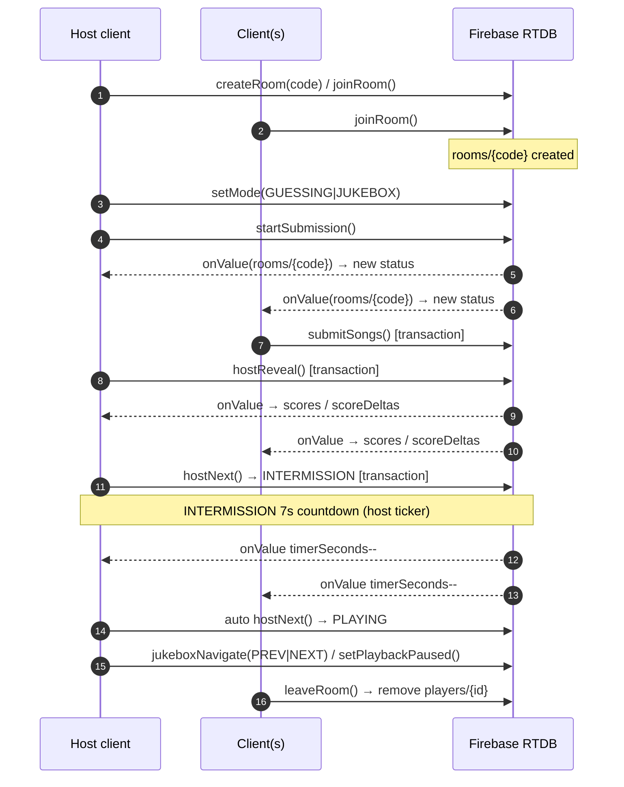
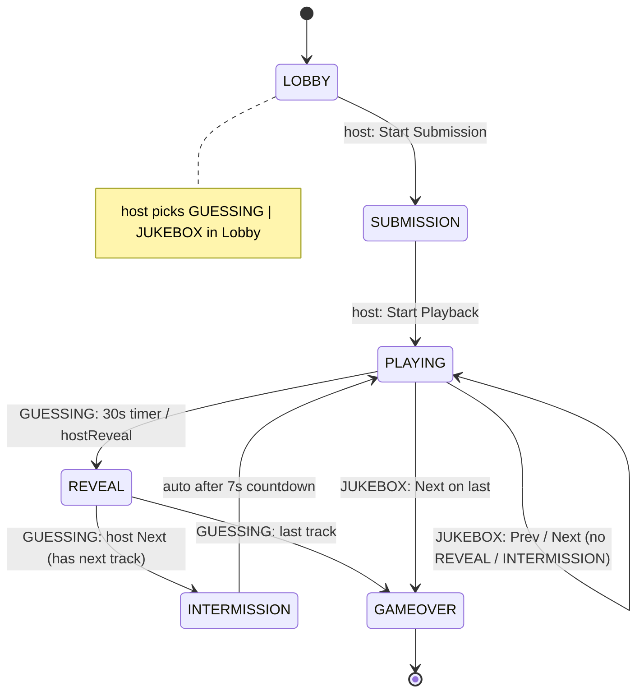

# Architecture

This document describes how **Play My Playlist** is structured, how the real-time game loop works, and the Firebase Realtime Database schema it syncs against.

## Tech Stack

- **Frontend:** React 18 + TypeScript, built with [Vite](https://vitejs.dev/)
- **Styling:** Tailwind CSS v3
- **Backend / Realtime Sync:** Firebase Realtime Database (modular SDK)
- **Video playback:** `react-youtube` (YouTube IFrame API)
- **Testing:** Vitest + jsdom
- **Hosting:** Vercel (static SPA, see `vercel.json`)

## High-Level Data Flow



Every client opens the URL, creates or joins a room, and then subscribes to a single Firebase node (`rooms/{roomCode}`) via the `onValue` listener. State changes (submissions, guesses, timer, status) are written by the acting client and **pushed to every other client live** — no polling, no server code.

## Directory Layout

```mermaid
graph TD
    SRC[src/]
    SRC --> APP[App.tsx<br/>top-level view router by status + mode]
    SRC --> MAIN[main.tsx<br/>ReactDOM entry]
    SRC --> CSS[index.css<br/>Tailwind + keyframes]
    SRC --> VITE[vite-env.d.ts<br/>env var typings]

    SRC --> TYPES[types/]
    TYPES --> GAME[game.ts<br/>Submission, Player, PlaylistTrack, RoomState,<br/>RoomStatus + GameMode]

    SRC --> LIB[lib/]
    LIB --> FB[firebase.ts<br/>app + db init]
    LIB --> YT[youtube.ts<br/>extractVideoId / processSubmissions]
    LIB --> SC[scoring.ts<br/>calculateRoundScores]
    LIB --> PL[playerLogic.ts<br/>snippetReducer + track nav<br/>INTERMISSION 7s + JUKEBOX 180s + navigateJukebox]
    LIB --> ST[storage.ts<br/>localStorage session helpers]

    SRC --> HOOKS[hooks/]
    HOOKS --> UR[useRoom.ts<br/>real-time room hook + all writes<br/>setMode / jukeboxNavigate / intermission ticker]

    SRC --> COMP[components/]
    COMP --> YTP[YouTubePlayer.tsx<br/>react-youtube wrapper]
    COMP --> GAMEV[game/]
    GAMEV --> ENTRY[EntryView.tsx<br/>Create / Join]
    GAMEV --> LOBBY[LobbyView.tsx<br/>room code + roster + mode toggle]
    GAMEV --> SUB[SubmissionView.tsx<br/>song form + readiness]
    GAMEV --> GV[GameView.tsx<br/>player + synced 30s timer + vote lock-in + audio-only]
    GAMEV --> JB[JukeboxView.tsx<br/>full playback + Prev/Next/Pause + open submitter]
    GAMEV --> IM[IntermissionView.tsx<br/>7s countdown banner]
    GAMEV --> REV[RevealView.tsx<br/>submitters + guesses]
    GAMEV --> LEAD[LeaderboardView.tsx<br/>rankings + confetti]
```



> Note: `src/components/{DedupPreview,RoomCard,SongSubmissionForm,PlayerStage}.tsx` are earlier-phase artifacts kept for reference; the live multiplayer flow uses the components under `src/components/game/`.

## Game Loop (state machine)

A room moves through these `status` values (see `RoomStatus` in `src/types/game.ts`):



**Host vs. Client:** The room has exactly one `hostId`. Only the host may transition status, run the global countdown, reveal scores, advance tracks, toggle `mode` in the lobby, and drive jukebox `Prev/Next/Pause`. Clients cast guesses (which lock immediately with a `Vote Locked ✅` indicator) and submit songs. Guessing mode uses the 30 s synced timer + `REVEAL` + 7 s `INTERMISSION` breathing space; jukebox mode hides voting/reveal and shows the submitter openly. This keeps a single source of truth and avoids conflicting transitions.

## Firebase Realtime Database Schema

Rooms are stored flat under `rooms/{roomCode}` where `roomCode` is a 4-letter code.

```
rooms/{roomCode}
├── roomCode: string        # "ABCD"
├── status: string          # LOBBY | SUBMISSION | PLAYING | REVEAL | INTERMISSION | GAMEOVER
├── mode: string            # GUESSING | JUKEBOX (default GUESSING)
├── hostId: string          # player id of the host
├── createdAt: number       # epoch ms
├── currentTrackIndex: number
├── timerSeconds: number    # guessing: 30->0 per snippet; intermission: 7->0; jukebox: 180 max
├── playbackPaused: boolean # jukebox pause state (synced, host-controlled)
├── guesses: { playerId: guessedName }
├── scoreDeltas: [ { playerId, playerName, delta, reason } ]  # last reveal only
├── players
│   └── { playerId }:
│       ├── id, name, score
│       ├── hasSubmitted: boolean
│       └── bestRound: number          # highest single-round delta
├── submissions
│   └── { playerId }: [ normalizedWatchUrls ]
└── tracks: [ { videoId, submittedBy[], played } ]   # deduplicated playlist
```

Concurrency-sensitive writes (`submitSongs`, `hostReveal`, `hostNext`, `jukeboxNavigate`) use Firebase **transactions** (`runTransaction`) so multiple clients don't clobber each other. Idempotent single-field writes (`submitGuess`, `startSubmission`, `setMode`, `setPlaybackPaused`) use `update`. `hostNext` is status-aware: `REVEAL` → `INTERMISSION` (7 s, next index) or `GAMEOVER`; `INTERMISSION` → `PLAYING` (auto-ticked by the host interval in `useRoom`); `SUBMISSION` → `PLAYING` (first track). `timerSeconds` is reused for both the 30 s snippet and the 7 s intermission countdown. `App.tsx` routes `INTERMISSION` → `IntermissionView` and branches `PLAYING` on `mode` → `GameView` (guessing) vs `JukeboxView` (casual).

## Session Persistence

A player's identity is stored in `localStorage` under `play_my_playlist_session` (`saveSession`/`getSession`/`clearSession` in `src/lib/storage.ts`). On reload, `useRoom` restores `myPlayerId` and re-subscribes; if the room or player no longer exists, the session is silently cleared and the user returns to `EntryView`.

## Testing

- **Vitest** with four pure-logic suites run under jsdom — `youtube`, `scoring`, `playerLogic` (timer + `navigateJukebox` + duration constants), and `storage`.
- Logic that touches Firebase (`useRoom`) is intentionally kept thin; the testable rules (dedupe, scoring, timer, intermission/jukebox navigation, session) live in pure modules under `src/lib/`. `playerLogic.test.ts` now covers `INTERMISSION_DURATION_SECONDS (7)`, `JUKEBOX_MAX_SECONDS (180)`, and `navigateJukebox()` (NEXT/PREV, clamping, single-track, empty, out-of-bounds).
- `GameView` enforces single-vote lock-in locally (`voteLocked` state + `Vote Locked ✅`) so votes cannot be changed/cleared even before the Firebase write propagates.
- Run everything with `npm test` (60 tests).
