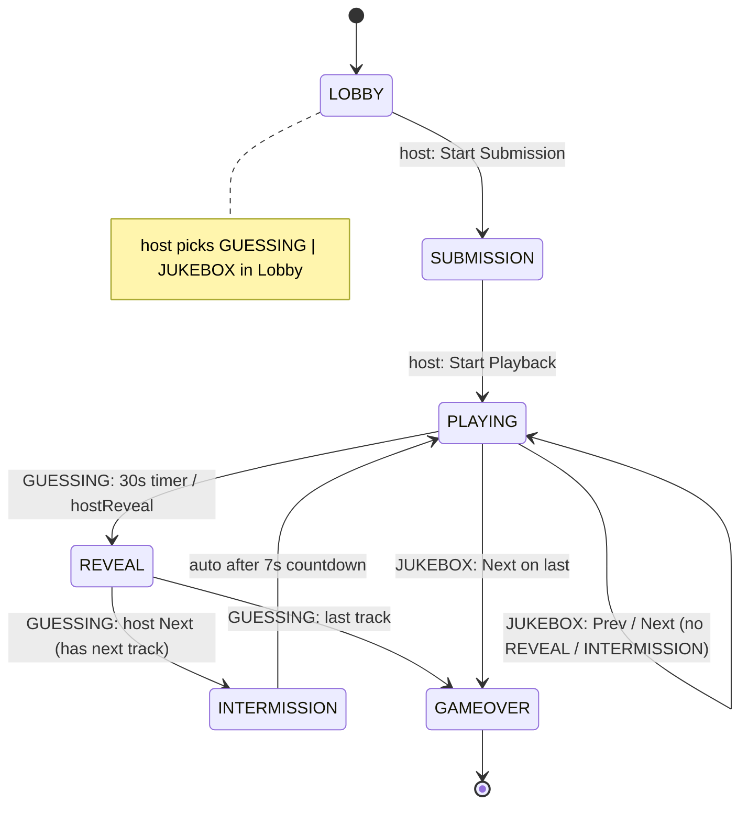

# Architecture

This document describes how **Play My Playlist** is structured, how the real-time game loop works, and the Firebase Realtime Database schema it syncs against.

## Tech Stack

- **Frontend:** React 18 + TypeScript, built with [Vite](https://vitejs.dev/)
- **Styling:** Tailwind CSS v3
- **Backend / Realtime Sync:** Firebase Realtime Database (modular SDK)
- **Video playback:** `react-youtube` (YouTube IFrame API)
- **Testing:** Vitest + jsdom
- **Hosting:** Vercel (static SPA, see `vercel.json`)

## High-Level Data Flow

```mermaid
sequenceDiagram
    autonumber
    participant H as Host client
    participant C as Client(s)
    participant F as Firebase RTDB

    H->>F: createRoom(hostName, roomName) / joinRoom() + onDisconnect(players/{id}).remove()
    C->>F: joinRoom() allowed in LOBBY/SUBMISSION/PLAYING/REVEAL/INTERMISSION (blocked only at GAMEOVER; duplicate names rejected via isNameTaken)
    Note over F: rooms/{code} created with roomName (e.g. Gully Groovers)
    H->>F: setMode(GUESSING|JUKEBOX)
    H->>F: startSubmission()
    F-->>H: onValue(rooms/{code}) → new status
    F-->>C: onValue(rooms/{code}) → new status
    C->>F: submitSongs() [transaction]
     H->>F: hostNext() SUBMISSION→PLAYING [transaction + shuffleFisherYates, host-only]
    Note over H,F: roundStartTime = correctedNow + offset, shuffled tracks
    F-->>H: onValue timerSeconds + roundStartTime
    F-->>C: onValue timerSeconds + roundStartTime
    C->>F: onReady seekTo((now - roundStartTime)/1000) drift fix
    H->>F: hostReveal() [transaction, status guard]
    F-->>H: onValue → scores / scoreDeltas
    F-->>C: onValue → scores / scoreDeltas
    H->>F: hostNext() → INTERMISSION [transaction + roundStartTime]
    Note over H,F: INTERMISSION 7s countdown (host ticker via roundStartTime delta)
    F-->>H: onValue timerSeconds--
    F-->>C: onValue timerSeconds--
    H->>F: auto hostNext() → PLAYING
    H->>F: jukeboxJump(index) / jukeboxNavigate(PREV|NEXT) / setPlaybackPaused() / jukeboxSeek(seconds) (anyone in JUKEBOX)
    Note over C,F: Jukebox: anyone can Prev/Pause/Next/Seek/tap queue, all seekTo same second
    C->>F: leaveRoom() → transaction removes players/{id}; last leave returns null → room auto-deleted
    Note over H,F: host failover: if hostId not in players, first remaining promoted
    F-->>H: onValue players diff → 🟢 joined / 🔴 left toast (Toasts.tsx, 4s)
    F-->>C: onValue players diff → 🟢 joined / 🔴 left + 👑 You are now host toast
    H->>F: playAgain() [transaction → LOBBY, roster kept, scores zeroed] / endRoom() → remove node
    Note over F: deleted node → all listeners route home (clearSession)
```

Every client opens the URL, creates or joins a room, and then subscribes to a single Firebase node (`rooms/{roomCode}`) via the `onValue` listener. State changes (submissions, guesses, timer, status) are written by the acting client and **pushed to every other client live** — no polling, no server code.

## Directory Layout

```mermaid
graph TD
    SRC[src/]
    SRC --> APP[App.tsx<br/>top-level view router by status + mode]
    SRC --> MAIN[main.tsx<br/>ReactDOM entry]
    SRC --> CSS[index.css<br/>Tailwind + keyframes]
    SRC --> VITE[vite-env.d.ts<br/>env var typings]

    SRC --> TYPES[types/]
    TYPES --> GAME[game.ts<br/>Submission, Player, PlaylistTrack, RoomState,<br/>RoomStatus + GameMode]

    SRC --> LIB[lib/]
    LIB --> FB[firebase.ts<br/>app + db init]
    LIB --> YT[youtube.ts<br/>extractVideoId / processSubmissions<br/>handles watch/youtu.be/shorts + ?t &list stripping]
    LIB --> SC[scoring.ts<br/>calculateRoundScores<br/>live-submitter split, self-farm blocked]
     LIB --> PL[playerLogic.ts<br/>snippetReducer + track nav<br/>INTERMISSION 7s + JUKEBOX 180s + navigateJukebox<br/>shuffleFisherYates via crypto.getRandomValues]
     LIB --> RN[roomNames.ts<br/>generateRoomName - Indian pop-culture word banks, ≤32 chars]
    LIB --> RL[roomLifecycle.ts<br/>resetPlayersForPlayAgain / removePlayer / buildPlayAgainReset / isNameTaken<br/>clampSongCount / limitUrls / hasExactCount + MIN/MAX/DEFAULT]
    LIB --> ST[storage.ts<br/>localStorage session helpers]
    SRC --> UTIL[components/Toasts.tsx<br/>players diff → 🟢/🔴/👑 toasts, 4s auto-dismiss]

     SRC --> HOOKS[hooks/]
    HOOKS --> UR[useRoom.ts<br/>real-time room hook + all writes<br/>createRoom/joinRoom + onDisconnect + mid-game rejoin (blocked only at GAMEOVER)<br/>setSongsPerPlayer (host + LOBBY only) / submitSongs (truncates to count)<br/>playAgain (host reset same room) / endRoom (host delete) / leaveRoom (last-leave auto-delete)<br/>hostNext (shuffle host-only; PLAYING skip open to anyone) / hostReveal (status guard)<br/>jukeboxNavigate/jukeboxJump/jukeboxSeek/ setPlaybackPaused (anyone)<br/>roundStartTime + serverOffset sync + host failover ticker + deleted-node home routing]

    SRC --> COMP[components/]
    COMP --> YTP[YouTubePlayer.tsx<br/>react-youtube wrapper<br/>seekTo/getCurrentTime/getDuration + onStateChange]
    COMP --> GAMEV[game/]
    GAMEV --> ENTRY[EntryView.tsx<br/>Create (Your Name + auto Room Name + 🎲 reroll) / Join (mid-game allowed, unique names)]
    GAMEV --> LOBBY[LobbyView.tsx<br/>🎬 roomName + room code + roster + mode toggle + host Songs-per-player stepper]
    GAMEV --> SUB[SubmissionView.tsx<br/>exactly-N song form (host-fixed count, no stepper) + readiness + Start Game/Playback (host enabled when tracks>0)]
      GAMEV --> GV[GameView.tsx<br/>player + absolute 30s timer + concealed dummy vote + hide-self + audio-only + Skip Unplayable (everyone, 101/150/100 only)]
    GAMEV --> JB[JukeboxView.tsx<br/>common shuffled queue + seek sync + seek bar + queue tap<br/>anyone Prev/Pause/Next/Seek/Skip + visible queue like Spotify]
    GAMEV --> IM[IntermissionView.tsx<br/>7s countdown banner]
    GAMEV --> REV[RevealView.tsx<br/>submitters + guesses + sit-out bonus]
    GAMEV --> LEAD[LeaderboardView.tsx<br/>rankings + tiebreak + confetti + host Play Again/End Room]
```

> Note: `src/components/{DedupPreview,RoomCard,SongSubmissionForm,PlayerStage}.tsx` are earlier-phase artifacts kept for reference; the live multiplayer flow uses the components under `src/components/game/`.

## Game Loop (state machine)

A room moves through these `status` values (see `RoomStatus` in `src/types/game.ts`):



**Host vs. Client:** The room has exactly one `hostId` for Guessing transitions, but the Jukebox common queue is **Spotify-like: anyone can control**. Only the host may transition `SUBMISSION→PLAYING` (with one-time Fisher–Yates shuffle), run the global countdown, `hostReveal`, and toggle `mode` in the lobby; `hostNext` is host-only except `PLAYING` skip (anyone can `Skip Unplayable Track` when `101/150/100`). In Jukebox, **any player** can drive `Prev/Next` (`jukeboxNavigate`), tap any queue row (`jukeboxJump`), `Seek` (`jukeboxSeek`), and `Pause` (`setPlaybackPaused`) — all synced via `roundStartTime` + server-clock offset. All clients submit songs and see the **same concealed voting UI**: `GameView` shows only other players (`candidates = players.filter(p≠me)`), no self-button, `hasVoted` locks to `Vote Locked ✅`. A submitter's tap is a **local dummy** (`dummyVote`, no `submitGuess` write, ignored by `scoring.ts` and excluded from `guessCount`/`eligible`), so every screen looks identical while keeping the watch-party synced. Votes are independent (no global `isTaken`), `101/150/100` shows **Skip Unplayable Track** to **everyone** (`Anyone can skip` banner) with `seekTo` drift fix. `Toasts.tsx` diffs `players` keys for `🟢 joined` / `🔴 left` / `👑 You are now host` (4 s) and `onDisconnect` auto-cleans ghosts; `SubmissionView` host Start is enabled when `tracks.length>0`, not gated on `allSubmitted`, so AFK / late joiners can't soft-lock.

## Firebase Realtime Database Schema

Rooms are stored flat under `rooms/{roomCode}` where `roomCode` is a 4-letter code.

```
rooms/{roomCode}
├── roomCode: string        # "ABCD"
├── roomName: string        # e.g. "Pokiri Playlist" — Telugu-cinema auto-generated, ≤32 chars, 🎲 reroll with 💡 meaning; host name is separate
├── songsPerPlayer: number  # host-fixed in LOBBY (1–10, default 3); submissions must match exactly, extras truncated
├── status: string          # LOBBY | SUBMISSION | PLAYING | REVEAL | INTERMISSION | GAMEOVER
├── mode: string            # GUESSING | JUKEBOX (default GUESSING)
├── hostId: string          # player id of the host (auto-failover to first remaining if host leaves)
├── createdAt: number       # epoch ms
├── currentTrackIndex: number
├── timerSeconds: number    # guessing: 30→0 per snippet; intermission: 7→0; jukebox: 180 max (derived from roundStartTime)
├── roundStartTime: number  # epoch ms (corrected with .info/serverTimeOffset), written on every PLAYING/INTERMISSION entry for absolute sync
├── playbackPaused: boolean # jukebox pause state (anyone can toggle, synced)
├── guesses: { playerId: guessedName }
├── scoreDeltas: [ { playerId, playerName, delta, reason } ]  # last reveal only (includes sit-out submitter bonuses)
├── players
│   └── { playerId }:
│       ├── id, name, score
│       ├── hasSubmitted: boolean
│       └── bestRound: number          # highest single-round delta
├── submissions
│   └── { playerId }: [ normalizedWatchUrls ]
└── tracks: [ { videoId, submittedBy[], played } ]   # deduplicated, shuffled once at start via shuffleFisherYates
```

Concurrency-sensitive writes (`submitSongs`, `hostReveal` with `status===PLAYING` guard, `hostNext` with shuffleFisherYates, `jukeboxNavigate`/`jukeboxJump`, `joinRoom` mid-game) use **transactions** (`runTransaction`) so multiple clients don't clobber each other. Idempotent single-field writes (`submitGuess`, `startSubmission`, `setMode`, `setPlaybackPaused`, `jukeboxSeek` via `update` with `roundStartTime` delta) use `update`. `joinRoom` is allowed in `LOBBY/SUBMISSION/PLAYING/REVEAL/INTERMISSION`, blocked only at `GAMEOVER` (`Game over — ask the host to start a new room`); `createRoom`/`joinRoom` register `onDisconnect(players/{id}).remove()` for tab-close ghost cleanup. `hostNext` is status-aware: `SUBMISSION→PLAYING` (host-only, shuffle + `roundStartTime`), `PLAYING` (skip unplayable → next `PLAYING` or `GAMEOVER`, **open to anyone**), `REVEAL→INTERMISSION` (host-only, 7 s, `roundStartTime`) or `GAMEOVER`; `INTERMISSION→PLAYING` (auto-ticked by host `roundStartTime` delta). Jukebox `Prev/Next`/`Jump`/`Seek` are **anyone-can** transactions that set `currentTrackIndex`, `roundStartTime`, `timerSeconds`. All timers are absolute `Math.max(0, duration - floor((correctedNow - roundStartTime)/1000))` to survive background tab throttling. Host failover promotes `Object.keys(players)[0]` if `hostId` leaves. `App.tsx` routes `INTERMISSION` → `IntermissionView` and branches `PLAYING` on `mode` → `GameView` (guessing, 30 s, concealed) vs `JukeboxView` (common queue, anyone controls, seek bar + queue tap), and mounts `Toasts` (players diff → `🟢/🔴/👑` 4 s). `SubmissionView` host Start now checks `tracks.length>0`, not `allSubmitted`.

## Session Persistence

A player's identity is stored in `localStorage` under `play_my_playlist_session` (`saveSession`/`getSession`/`clearSession` in `src/lib/storage.ts`). On reload, `useRoom` restores `myPlayerId` and re-subscribes; if the room or player no longer exists, the session is silently cleared and the user returns to `EntryView`.

## Testing

- **Vitest** with five pure-logic suites run under jsdom — `youtube`, `scoring`, `playerLogic` (timer + `navigateJukebox` + `shuffleFisherYates` + duration constants), `storage`, and `roomNames`.
- Logic that touches Firebase (`useRoom`) is intentionally kept thin; the testable rules (dedupe, scoring, timer, shuffle, intermission/jukebox navigation, roundStartTime drift, sit-out, session, room-name generation) live in pure modules under `src/lib/`. `playerLogic.test.ts` covers `INTERMISSION_DURATION_SECONDS (7)`, `JUKEBOX_MAX_SECONDS (180)`, `navigateJukebox()`, and `shuffleFisherYates`; `roomNames.test.ts` covers `generateRoomName()` format/length/variety.
- `GameView` enforces concealed voting: every screen shows only others (no self), `voteLocked` + `isSubmitter` dummy (local `dummyVote`, no Firebase write, indistinguishable `Vote Locked ✅`), no global `isTaken` steal; scoring guards + `hostReveal` `status===PLAYING` guard prevent double-scoring. `EntryView` keeps `Your Name` and `Room Name` strictly separate.
- Run everything with `npm test` (68 tests).
