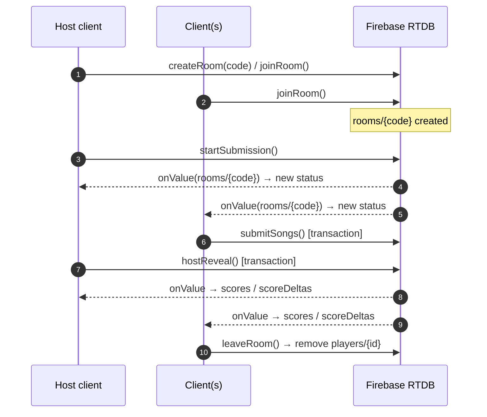
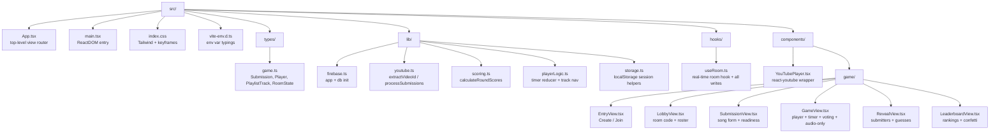
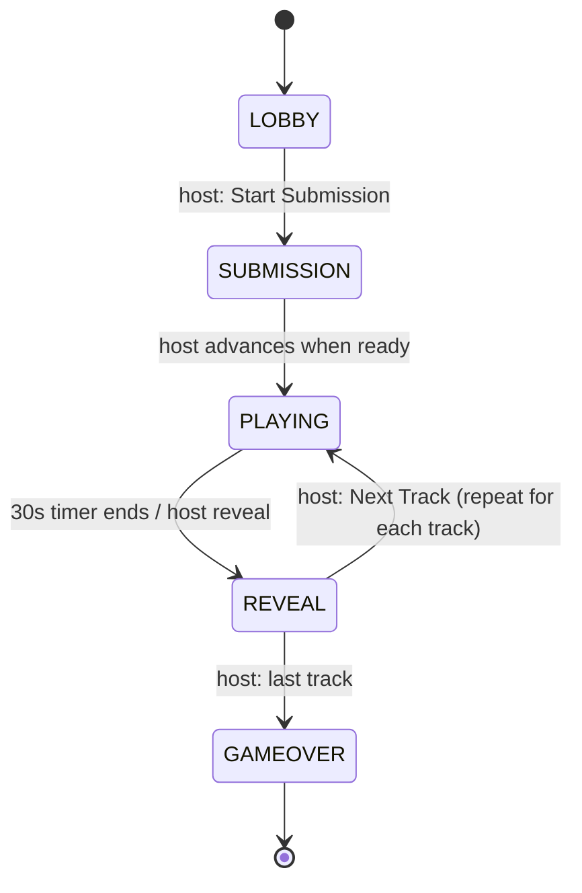

# Architecture

This document describes how **Play My Playlist** is structured, how the real-time game loop works, and the Firebase Realtime Database schema it syncs against.

## Tech Stack

- **Frontend:** React 18 + TypeScript, built with [Vite](https://vitejs.dev/)
- **Styling:** Tailwind CSS v3
- **Backend / Realtime Sync:** Firebase Realtime Database (modular SDK)
- **Video playback:** `react-youtube` (YouTube IFrame API)
- **Testing:** Vitest + jsdom
- **Hosting:** Vercel (static SPA, see `vercel.json`)

## High-Level Data Flow



Every client opens the URL, creates or joins a room, and then subscribes to a single Firebase node (`rooms/{roomCode}`) via the `onValue` listener. State changes (submissions, guesses, timer, status) are written by the acting client and **pushed to every other client live** — no polling, no server code.

## Directory Layout



> Note: `src/components/{DedupPreview,RoomCard,SongSubmissionForm,PlayerStage}.tsx` are earlier-phase artifacts kept for reference; the live multiplayer flow uses the components under `src/components/game/`.

## Game Loop (state machine)

A room moves through these `status` values (see `RoomStatus` in `src/types/game.ts`):



**Host vs. Client:** The room has exactly one `hostId`. Only the host may transition status, run the global countdown, reveal scores, and advance tracks. Clients cast guesses and submit songs. This keeps a single source of truth and avoids conflicting transitions.

## Firebase Realtime Database Schema

Rooms are stored flat under `rooms/{roomCode}` where `roomCode` is a 4-letter code.

```
rooms/{roomCode}
├── roomCode: string        # "ABCD"
├── status: string          # LOBBY | SUBMISSION | PLAYING | REVEAL | GAMEOVER
├── hostId: string          # player id of the host
├── createdAt: number       # epoch ms
├── currentTrackIndex: number
├── timerSeconds: number    # 30 -> 0
├── guesses: { playerId: guessedName }
├── scoreDeltas: [ { playerId, playerName, delta, reason } ]  # last reveal only
├── players
│   └── { playerId }:
│       ├── id, name, score
│       ├── hasSubmitted: boolean
│       └── bestRound: number          # highest single-round delta
├── submissions
│   └── { playerId }: [ normalizedWatchUrls ]
└── tracks: [ { videoId, submittedBy[], played } ]   # deduplicated playlist
```

Concurrency-sensitive writes (`submitSongs`, `hostReveal`, `hostNext`) use Firebase **transactions** (`runTransaction`) so multiple clients don't clobber each other. Idempotent single-field writes (`submitGuess`, `startSubmission`) use `update`.

## Session Persistence

A player's identity is stored in `localStorage` under `play_my_playlist_session` (`saveSession`/`getSession`/`clearSession` in `src/lib/storage.ts`). On reload, `useRoom` restores `myPlayerId` and re-subscribes; if the room or player no longer exists, the session is silently cleared and the user returns to `EntryView`.

## Testing

- **Vitest** with three pure-logic suites (`youtube`, `scoring`, `playerLogic`) plus a `storage` suite run under jsdom.
- Logic that touches Firebase (`useRoom`) is intentionally kept thin; the testable rules (dedupe, scoring, timer, session) live in pure modules under `src/lib/`.
- Run everything with `npm test`.
